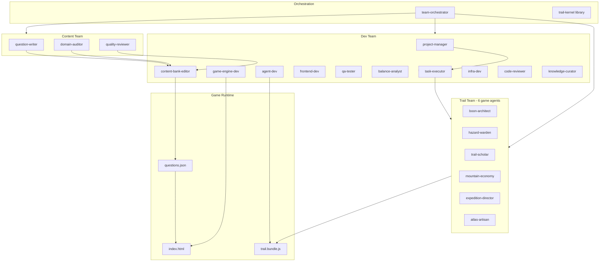

# Minkey-HQ Agent Worker Team

**The RBT Trail** — complete worker roster, commands, and playbooks.

> You asked for the entire team and more help than you could want. This is it.

---

## Quick start (60 seconds)

```bash
# 1. Health check
npm run verify:trail && npm run sync-check

# 2. Play the game
npm run dev
# → http://localhost:4173

# 3. Boot the worker team (in Cursor)
/run team-orchestrator start-team
```

**Self-hosted / cloud agent:**
```bash
agent worker start --worker-dir /workspace
/run team-orchestrator agent-worker-start
```

---

## The three teams

### Orchestration (start here)

| Worker | What it does |
|--------|--------------|
| **team-orchestrator** | Boot team, route tasks, daily brief, full check |
| **trail-kernel** | Shared context library (file map, events, verify commands) |

```
/run team-orchestrator start-team
/run team-orchestrator route-task "add a new boon that reduces threat on streaks"
/run team-orchestrator daily-brief
/run team-orchestrator full-check
/run team-orchestrator agent-worker-start
```

### Trail Team — 6 in-game agent maintainers

Each worker maps 1:1 to `src/agents/*.js`.

| Worker | Icon | Source file | Skills |
|--------|------|-------------|--------|
| **boon-architect** | 🎒 | `boon-architect.js` | audit-boons, add-boon, tune-draft, add-duo |
| **hazard-warden** | ⛈️ | `hazard-warden.js` | audit-bestiary, add-hazard, tune-scaling |
| **trail-scholar** | 📚 | `trail-scholar.js` | audit-domains, tune-scheduler, add-question-type |
| **mountain-economy** | ⚖️ | `mountain-economy.js` | tune-config, audit-weather, audit-relics |
| **expedition-director** | 🧭 | `expedition-director.js` | audit-route, tune-acts, add-node-slot |
| **atlas-artisan** | 🎨 | `atlas-artisan.js` | audit-ui, update-copy, add-token |

```
/run boon-architect audit-boons
/run hazard-warden audit-bestiary
/run trail-scholar audit-domains
/run mountain-economy tune-config
/run expedition-director audit-route
/run atlas-artisan audit-ui
```

### Dev Team — 11 development workers

| Worker | Skills | Best for |
|--------|--------|----------|
| **project-manager** | create-prd, next-issue, update-learnings | Planning features |
| **task-executor** | execute, analyze-issue, validate-completion | Running multi-step work |
| **game-engine-dev** | edit-encounter, edit-screen, fix-engine-bug | `index.html` engine |
| **agent-dev** | edit-agent, add-hook, rebuild-bundle | `src/agents/`, kernel |
| **frontend-dev** | style-screen, fix-layout, a11y-pass | UI/CSS |
| **qa-tester** | run-check, smoke-test, verify-agents | CI gate |
| **balance-analyst** | run-sim, compare-runs, set-targets | Difficulty tuning |
| **content-bank-editor** | edit-question, sync-bank, validate-bank | Bank pipeline |
| **infra-dev** | fix-ci, update-workflow, check-pages | GitHub Actions |
| **code-reviewer** | review-pr, check-bundle, check-sync | PR quality |
| **knowledge-curator** | update-docs, capture-learning, check-drift | Docs |

### Content Team — 3 content workers

| Worker | Skills | Best for |
|--------|--------|----------|
| **question-writer** | draft-question, rewrite-question, batch-draft | New exam items |
| **domain-auditor** | audit-coverage, rebalance-domains, domain-report | TCO A–F balance |
| **quality-reviewer** | run-audit, review-flagged, create-overhaul-batch | Quality scoring |

---

## "I want to…" routing table

| I want to… | Run this |
|------------|----------|
| See all workers | `/run` or `/run team-orchestrator start-team` |
| Know who handles my task | `/run team-orchestrator route-task "…"` |
| Add a boon | `/run boon-architect add-boon "…"` → `balance-analyst` → `qa-tester` |
| Add a hazard | `/run hazard-warden add-hazard "…"` → `game-engine-dev` |
| Fix difficulty | `/run mountain-economy tune-config` → `balance-analyst run-sim` |
| Write questions | `/run question-writer draft-question` → `content-bank-editor sync-bank` |
| Fix CI | `/run infra-dev fix-ci` |
| Review a PR | `/run code-reviewer review-pr` |
| Plan a feature | `/run project-manager create-prd "name"` |
| Run everything | `/run team-orchestrator full-check` |

---

## Architecture diagram



---

## Verification cheat sheet

| You changed… | Run |
|--------------|-----|
| `src/agents/` or `src/core/` | `npm run build:trail && npm run verify:trail` |
| `data/questions.json` | `npm run sync && npm run sync-check` |
| Economy / boons / hazards | `npm run balance` (don't commit unless intentional) |
| Anything before PR | `npm run check` |
| Content quality | `npm run audit` + `npm run playground` |

---

## Knowledge base

| File | Contents |
|------|----------|
| `knowledge/rbt-trail/OVERVIEW.md` | 30-second architecture |
| `knowledge/rbt-trail/GOTCHAS.md` | CI failures, stale bundle, sync drift |
| `knowledge/rbt-trail/TCO-DOMAINS.md` | Exam domains A–F, question schema |
| `knowledge/rbt-trail/WORKFLOWS.md` | Multi-worker pipelines |
| `knowledge/rbt-trail/AGENTS.md` | Hook bus, CONFIG, agent APIs |
| `docs/ARCHITECTURE.md` | Codebase layout |
| `workers/registry.yaml` | Machine-readable worker index |

---

## Project structure

```
workers/
  registry.yaml              ← worker index (22 entries)
  orchestration/             ← team-orchestrator, trail-kernel
  trail-team/                ← 6 game agent workers
  dev-team/                  ← 11 dev workers
  content-team/              ← 3 content workers
knowledge/rbt-trail/         ← shared context for all workers
projects/                    ← PRDs (project-manager)
workspace/reports/           ← worker output reports
.claude/commands/run.md      ← /run slash command
```

---

## Registry

Full machine-readable index: `workers/registry.yaml`

```bash
# Count workers
grep -c "id:" workers/registry.yaml
```

---

## Still stuck?

1. `/run team-orchestrator route-task "describe what you want"`
2. Read `knowledge/rbt-trail/GOTCHAS.md`
3. `npm run check` and fix the first failing step
4. `npm run dev` and play-test manually
